# Task 1 methodology and evidence

This document records the **original vector baseline**. Current training defaults now use
the spatial revision described in `colab/README.md`; it has not yet had a full GPU training
run. Original results and deployed weights remain available for comparison.

## Data

Use the adapted dataset specification. Official Oxford split IDs are downloaded from
Oxford and verified by MD5. Official train+validation IDs are repartitioned with seed 42
by resized-image content hash; test IDs remain unchanged. Two development/test duplicates
are removed only from development. Original IDs are retained in every manifest.

Training uses fresh runtime corruptions with four equal-probability classes. Salt-and-pepper
samples probabilities uniformly in [0.02,0.15], blur samples kernels {3,5,7} and sigma
uniformly in [0.5,2.5], and occlusion samples 1–3 non-overlapping rectangles and target
coverage uniformly in [0.10,0.35]. Occlusion placement uses randomly positioned rectangles
within separate horizontal bands; this is a reproducible design choice, and its spatial
bias should be discussed as a limitation. The measured union fraction is recorded.

Validation is balanced and deterministic. Each test photo is evaluated on clean plus
three severities for each corruption. Test data is not used for Optuna or checkpoint selection.

## Selected architecture

```mermaid
flowchart LR
    X[RGB input 3 x 128 x 128] --> E1[Conv 32 x 64 x 64]
    E1 --> E2[Conv 64 x 32 x 32]
    E2 --> E3[Conv 128 x 16 x 16]
    E3 --> E4[Conv 256 x 8 x 8]
    E4 --> Z[Linear latent: 512 values]
    Z --> F[Linear expansion: 256 x 8 x 8]
    F --> D1[Transpose conv 128 x 16 x 16]
    D1 --> D2[Transpose conv 64 x 32 x 32]
    D2 --> D3[Transpose conv 32 x 64 x 64]
    D3 --> Y[Transpose conv + sigmoid: RGB 128 x 128]
```

Encoder and decoder convolutions have 4×4 kernels, stride 2 and padding 1. Hidden layers
use ReLU; encoder layers use tuned spatial dropout. There are no skip connections and
no corruption-label input. The 512-value latent is smaller than the 49,152-value input.
The experiment investigates this architecture family; it does not establish superiority
over all possible autoencoder families.

## Training and tuning

Loss: `alpha * mean_absolute_error + (1-alpha) * (1-SSIM)`.
SSIM uses valid 11×11 Gaussian windows (sigma 1.5), three RGB channels and data range 1.
Adam trains the model from scratch. Random initialization, runtime corruption and loader
ordering are seeded. Validation selects the checkpoint using fixed 0.8/0.2 L1/SSIM weights
so alpha tuning is compared against a consistent criterion.

Six Optuna trials were requested, each with three epochs over the full training split.
Five completed and one was pruned. Trial 0 was selected. Its configuration is:

| Parameter | Selected value |
|---|---:|
| Base encoder channels | 32 |
| Latent values | 512 |
| Dropout | 0.2909729556 |
| Alpha | 0.8745991884 |
| Learning rate | 0.0003574712923 |
| Batch size | 16 |
| Final schedule | 20 epochs |

This short search is an initial practical budget. Early trial rankings can differ from
long-schedule rankings; a stronger research study would expand the budget and repeat seeds.
The final model is independently retrained on the full training split; its test results
must be read from the evaluation artifacts rather than inferred from trial metrics.

## Evidence locations

- `data/prepared_v2/metadata.json`: provenance policy, split counts and exclusions.
- `runs/task1/search/`: persistent study, search space, trial CSV, selected configuration
  and optimization-history graph.
- `runs/task1/final/`: selected checkpoint, actual configuration, epoch metrics and curves.
- `runs/task1/evaluation/`: grouped metrics, per-image CSV, representative panels and four
  distinct-photo failure candidates.
- `models/universal.json`: input contract and numerical export-parity check.
- `runs/task1/ui/`: desktop/mobile screenshots and a downloaded result.
- `mlflow.db` and `mlruns/`: experiment tracking and artifacts.

The four failure candidates and representative examples need written interpretation in
the final IEEE LaTeX report. Identify loss of fine texture, boundary errors, missing-region
reconstruction and any deterioration of already-clean or mildly blurred inputs. Compare
restored scores with the recorded input baseline; do not assume every corruption improves.

## Assistance and outstanding submission items

Codex assisted with the pipeline, model, scripts, web application, tests and documentation.
Validation includes split/hash disjointness, deterministic corruption replay, actual mask
coverage, runtime resampling, latent gradients, API upload handling, numerical ONNX parity,
production React build and headless Chrome upload/restoration/download/mobile checks.

The React interface has not been produced in Google Stitch. Docker Compose configuration
is validated, but Docker Desktop's daemon was unavailable for a container run. Capture
Stitch provenance, run containers on a machine with Docker active, interpret results,
prepare the IEEE paper and record the submission demonstration before calling all
assignment submission requirements complete.
